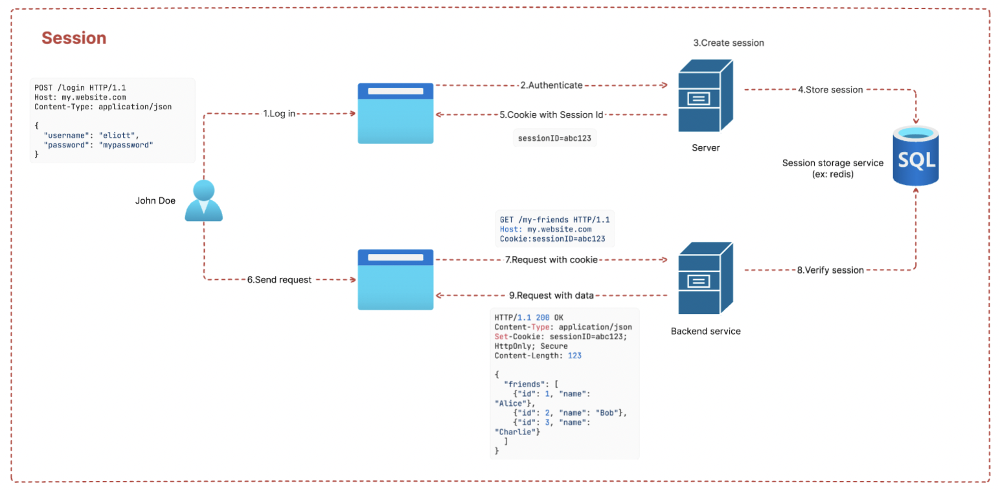
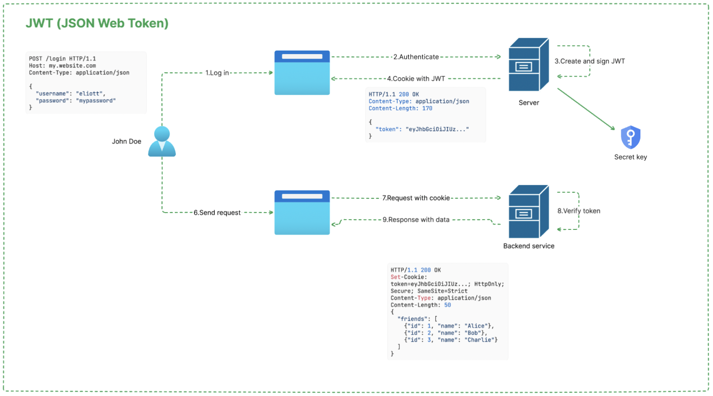

# Authentication

Authentication is the process of verifying the identity of users, devices, or systems before granting access to resources. It is a fundamental concept in cybersecurity and access control.


## Introduction

- Authentication ensures that only legitimate users can access systems and data.
- It is the first step in access control, followed by authorization.
- Different authentication methods exist, including passwords, biometrics, and multi-factor authentication (MFA).
- Similar to how Linux file permissions restrict access to files, authentication mechanisms control access to accounts and resources.

Example: Logging into your account with your email and password

Authentication  answers two questions:
- “Who are you?”
- "Are you really who you claim to be ?"

## Concept of authentication models

- Authentication is a subset of access control, verifying identity before granting permissions.
- Compare authentication models in operating systems, databases, and web applications.

### Operating system authentication

- Users authenticate using credentials like usernames and passwords.
- Linux and Windows store authentication data securely (e.g., `/etc/shadow` in Linux).
- Authentication controls who can log in and access system resources.

### Database authentication

- Users authenticate using credentials stored in the database.
- Authentication methods include database-native authentication and external authentication (LDAP, Kerberos, Oauth, etc).

### Web Application authentication

- Users log in using credentials, OAuth tokens, or single sign-on (SSO) mechanisms.
- Web applications store session data to maintain authentication state.
- Password hashing and salting improve security.

## Types of authentication

### Single-factor authentication (SFA)

- Relies on one factor, typically a password.
- Less secure as it can be compromised through brute force attacks or phishing.

### Multi-factor authentication (MFA)

- Involves two or more factors:
  - **Something you know** (password, PIN)
  - **Something you have** (security token, smartphone)
  - **Something you are** (biometrics: fingerprint, facial recognition)
- Adds an extra layer of security against credential theft

### Password-based authentication

- The most common authentication method.
- Best practices:
  - Use strong passwords (length, complexity, uniqueness).
  - Avoid password reuse.
  - Implement password managers.
  - Use password hashing algorithms like bcrypt, PBKDF2, or Argon2.

### Token-based authentication

- Uses temporary access tokens instead of credentials.
- Examples:
  - OAuth 2.0 (used by Google, Facebook, GitHub for authentication)
  - JWT (JSON Web Token) for stateless authentication
  - API keys for programmatic access

### Biometric authentication

- Uses physical characteristics for authentication.
- Examples:
  - Fingerprint recognition
  - Facial recognition
  - Retina scans
- Benefits: Harder to forge compared to passwords.
- Drawbacks: Privacy concerns, biometric data breaches are irreversible.

### Public key authentication

- Uses cryptographic key pairs for authentication.
- Common in SSH authentication:
  ```bash
  ssh-keygen -t rsa -b 4096
  ssh-copy-id user@server
  ```
- More secure than password-based authentication.

## Authentication management

### User account management

- Enforce password policies (expiration, complexity requirements).
- Implement account lockouts after failed login attempts.
- Use identity management systems to centralize authentication.

### Session management

- Sessions track authenticated users.
- Best practices:
  - Use short session expiration times.
  - Implement secure cookies with `HttpOnly` and `Secure` flags.
  - Use CSRF tokens to prevent session hijacking.

### Session vs JWT

**Session-Based Authentication**



✔ Stored on the server: User sessions are stored in-memory (Redis, DB, etc.).
✔ Stateful: The server keeps track of active sessions.
✔ Uses cookies: Usually, a session ID is stored in a cookie.
✔ Short lifespan: Typically expires after inactivity or when the browser is closed.
✔ More secure for sensitive data: Since data isn’t exposed to the client.
✖ Scaling issues: Requires session synchronization across multiple servers.
✖ Needs extra storage: Sessions must be stored somewhere.

**JWT-Based Authentication**



✔ Stored on the client: JWT is self-contained and sent with each request.
✔ Stateless: The server doesn’t store authentication state.
✔ Can be stored anywhere: LocalStorage, sessionStorage, cookies, etc.
✔ Better for scaling: Works well in microservices & distributed systems.
✔ Can carry more data: Useful for authorization claims (e.g., roles, permissions).
✔ All authentication mechanisms can be delegated to third-party
✖ Security concerns: If stored in localStorage, it’s vulnerable to XSS.
✖ Harder to revoke: Needs a blacklist or token expiration strategy.

### Authentication logs and monitoring

- Monitor authentication attempts for suspicious activity.
- Log failed login attempts, brute force attacks, and unusual login patterns.
- Tools: Fail2Ban, SIEM solutions.

## Authentication threats and mitigation

### Brute force attacks

- Attackers try multiple password combinations.
- Mitigation:
  - Implement account lockouts.
  - Use CAPTCHA for login forms.
  - Enforce MFA.

### Phishing attacks

- Attackers trick users into revealing credentials.
- Mitigation:
  - Train users to recognize phishing attempts.
  - Implement email filtering and anti-phishing tools.
  - Use MFA to reduce impact.

### Man-in-the-Middle (MitM) attacks

- Attackers intercept authentication data over insecure channels.
- Mitigation:
  - Enforce HTTPS/TLS encryption.
  - Use VPNs for secure communication.
  - Implement mutual TLS authentication.

### Credential stuffing

- Attackers use leaked credentials from data breaches.
- Mitigation:
  - Enforce unique passwords per site.
  - Monitor for leaked credentials.
  - Implement MFA.

## Secure authentication best practices

- Always encrypt authentication data in transit (TLS) and at rest.
- Use federated authentication systems (SSO, OAuth) when possible.
- Regularly audit authentication logs and enforce least privilege access.
- Educate users on safe authentication practices.

Authentication is the cornerstone of secure access control. Implementing robust authentication mechanisms ensures that only authorized users gain access to systems and data, reducing security risks.
